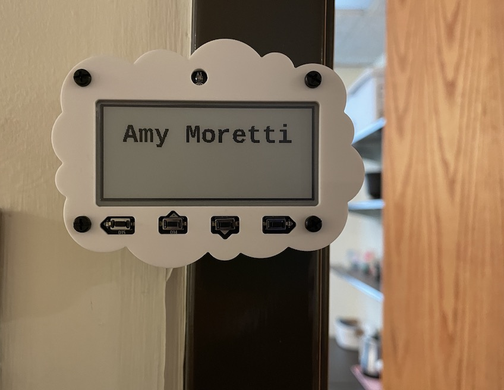

# Office Door Sign Using Adafruit Magtag

-------------------------

With the return to the office in the midst of the COVID-19 pandemic, rules were implemented that if you wanted to work with no mask on, you would need to close your door.  This presented a problem in that because our doors are solid wood, it was impossible to know if someone was in their office, in a meeting, busy, or otherwise wished to not be bothered.  My solution to this was to build a small e-ink sign that can be updated at the press of a button.  It then hibernates into a deep sleep, conserving battery power so that the sign does not need to be charged often.

-------------------------

## Supplies
- [Adafruit Magtag Starter Kit - ADABOX017 Essentials](https://www.adafruit.com/product/4819)
- Small phillips head screwdriver
- Usb-C cable capable of data-sync (a cable meant for just charging will not work).  I used the cable that came included with my iPad Mini 6.

-------------------------

## Getting Started
The first step is to install Circuit Python onto the board.  Download the .bin of latest release [here](https://circuitpython.org/board/adafruit_magtag_2.9_grayscale/), then connect the Magtag to your computer. You should see it as an external drive named **MAGTAGBOOT**.  You can now drag and drop Circuit Python into the main directory of the board.  It will restart and now appear as an external drive named CIRCUITPY.  Now you will need to download the package of [Circuit Python Libraries](https://circuitpython.org/libraries) to install on the board.  Because the board cannot hold much data, you will only want to install the libraries that you need.  In this case you want to install:
- adafruit_bitmap_font
- adafruit_display_text
- adafruit_fakerequests
- adafruit_io
- adafruit_magtag
- adafruit_portalbase
- adafruit_requests
- neopixel.mpy
- simpleio.mpy

The next step is to create your Secrets.py file.  While internet connectivity is not a requirement for this project, the file is a requirement for the board to run. Simply create a Secrets.py file with the following information:

```
  #This file is where you keep secret settings, passwords, and tokens!
  #If you put them in the code you risk committing that info or sharing it

  secrets = {
      'ssid' : ,
      'username' : ,
      'password' : ,
      'timezone' : , #Find your timezone name here: http://worldtimeapi.org/timezones
    }
```

-------------------------

## The Code

The code for this is fairly straight forward.  You code needs to be placed in a file named `code.py`.

You want your imports to make sure everything will work:
```
from adafruit_magtag.magtag import MagTag
import alarm
import board
import digitalio
import neopixel
import time
```

The very first thing you will want after your imports is the alarm for waking the board.  We will be using the alarms module to both place the board into deep sleep, and wake it.  Through a long process of frustration it was determined that the alarm must go before initializing adafruit.magtag, as otherwise it will tell you the button is already being used.  Apparently the Magtag doesn't like to share.

```pin_alarm = alarm.pin.PinAlarm(pin=board.D11, value=False, pull=True)```

As you'll see we are directing it to pin D11, which is the rightmost button.

Next you will want to set up your default display.  The Magtag works in the idea of layers, so the first block of text you add will be index 0, then the next will be index 1, and so forth.  It's possible to add lots of custom formatting and text, but for this purpose I chose one block of text.  The other important step here is loading your font.  By default the Magtag has only a default font in a small size.  If you wish to change the font or size you will need to load in a font.  This part can be a bit annoying as the Magtag only accepts bitmap fonts in .bdf format.  In order to use a font with the Magtag you must convert it, which Adafruit has well documented [here](https://learn.adafruit.com/custom-fonts-for-pyportal-circuitpython-display/conversion).  It's a fairly straightforward process.  For my board I chose to use [Cousine](https://fonts.google.com/specimen/Cousine).

The default textbox on my board is 
```
mid_x = graphics.display.width // 2 - 1
magtag.add_text(
    text_font="cousinebold-36.bdf",
    text_position=(mid_x, 20),
    text_anchor_point=(0.5, 0),
    is_data=False,)
magtag.set_text("Amy Moretti")
```

This centers the text in the upper half of the board.  At 36 pixel size, the font is large and clear enough to read as a door sign.

Next up is the sleep and controlling the button presses.  

```
time_span = 0.01;
total_sleep_time = 15;
time_elapsed = 0;

while time_elapsed < total_sleep_time:
    if peripherals.button_a_pressed:
        magtag.set_text("Please knock")
    elif peripherals.button_b_pressed:
        magtag.set_text("In a meeting,\n slack me")
    elif peripherals.button_c_pressed:
        magtag.set_text("Remote today")
    elif peripherals.button_d_pressed:
        magtag.set_text("BRB")

    time_elapsed = time_elapsed + time_span
    time.sleep(time_span)
```

Each of the buttons are given a letter assignment, this is by default with the Magtag.  Accessing whether or not they have been pressed is very easy, you simply need to call `magtag.peripherals.button_a_pressed` for the leftmost button, and so on.  This makes setting the message text extremely easy.  Because we implemented the alarm to wake associated with the D button (rightmost) before beginning the rest of our code, the Magtag is happy to make use of it so you can utlitize this button as well.   After defining your time variables and what you want your buttons to do, simply finalize it with `alarm.exit_and_deep_sleep_until_alarms(pin_alarm)`.  We pass the pin_alarm to the deep sleep so that it knows what to expect to wake it.  Another button press will not wake the board.

-------------------------

## In Use

With the case assembled and the magnet feet screwed in, the board is now ready to function as a door sign.  I have it attached to the metal doorframe of my office door, right where the signs normally are.  Now, any time I wish to set my current status I simply press the D button to wake the board, press the button associated with the status I want to use.  Easy peasy!

The default text:



Please knock message:


In a meeting, Slack me! message:


